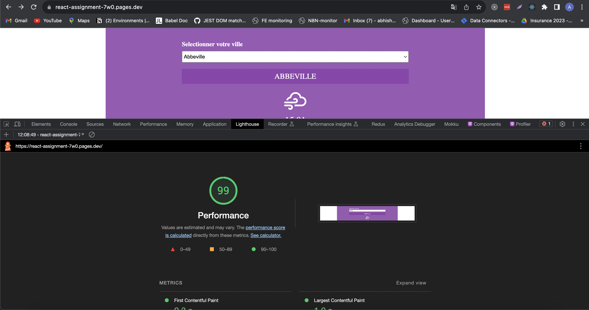
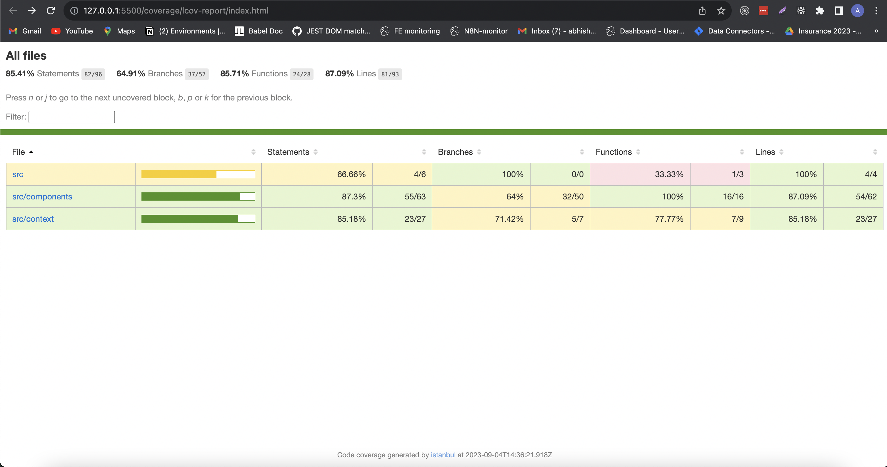

# React-assingment

> Approach used to create the project.

Tools used to build the project: webpack, babel, jest, enzyme, axios, react, react-dom.

Context: To keep the current and forecast data of cities, cityContext is used.

Single page app broken into various components.

Unless both current and forecast data is loaded, we display loader below the citySelect menu.

Webpack config added for dev and prod builds.

Test cases written using jest and enzyme.

> Running the project 

Assuming yarn is setup on system install the dependencies via yarn install.

1. To run locally -->  *yarn start*

    Project opens on **http://localhost:9000/** automatically with hot module replacement on.

2. Prod deployment done on CF pages ( main branch deployed )

    Link : **https://react-assignment-7w0.pages.dev/**

3. To build the project locally : *yarn build*

4. To update snapshots: *yarn test*

5. To get updated coverage report: *yarn coverage*

6. To run prettier: *yarn prettier:write*

> LH stats

> Test Coverage report

